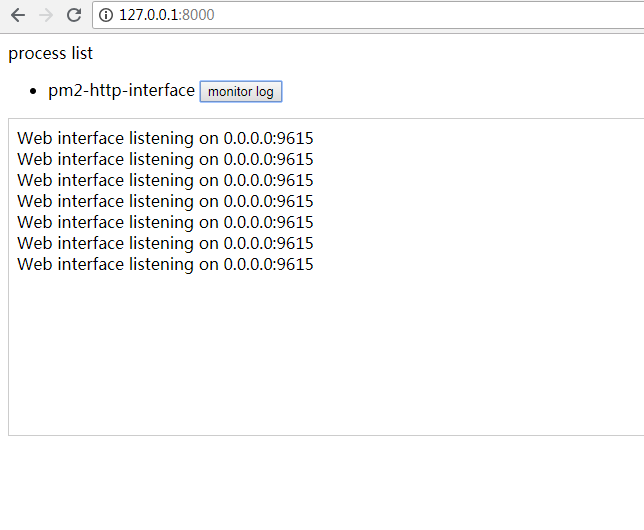

<h1 align="center">Welcome to monitor-pm2-log-web-todo 👋</h1>
<p>
  
</p>

> monitor pm2 log in browser

## Install

```sh
npm install
```

## Run tests

```sh
npm run test
```

## UI



## Author

👤 **Cr.**

* Github: [@a631807682](https://github.com/a631807682)

## 🤝 Contributing

Contributions, issues and feature requests are welcome!<br />Feel free to check [issues page](https://github.com/a631807682/monitor-pm2-log-web-todo/issues).

## Show your support

Give a ⭐️ if this project helped you!

***
_This README was generated with ❤️ by [readme-md-generator](https://github.com/kefranabg/readme-md-generator)_


